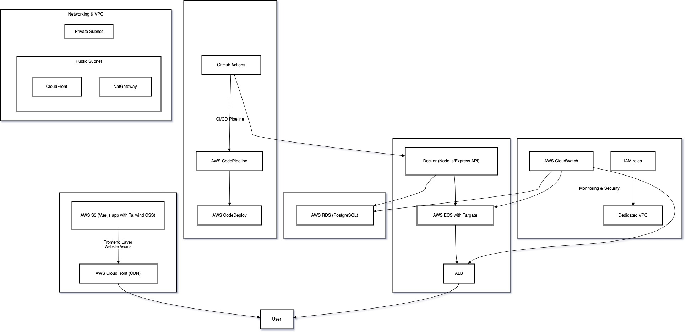

# DevHub Forum

DevHub Forum is a full‑stack cloud application built to showcase my journey into cloud engineering. The project demonstrates:

- **Modern Web Development**: A responsive frontend built with Vue.js and Tailwind CSS.
- **Backend API**: A Node.js/Express server for authentication, posts, and comments.
- **Cloud Deployment**: Containerization with Docker, deployed on AWS ECS Fargate, using an Application Load Balancer and AWS RDS PostgreSQL.
- **CI/CD and Monitoring**: Plans for automated deployments (GitHub Actions + AWS CodePipeline) and custom CloudWatch dashboards.

## Table of Contents
- [Overview](#devhub-forum)
- [Technical Architecture](#technical-architecture)
- [Repository Structure](#repository-structure)
- [Setup & Deployment](#setup--deployment)
- [Challenges & Future Improvements](#challenges--future-improvements)
- [Screenshots](#screenshots)
- [License](#license)

## Using DevHub

You can **register** your own account by clicking "Register" in the app, or **use the default credentials**:

- **Email:** `test@example.com`
- **Password:** `devhub`

Once logged in, you can view the feed, create posts, comment, and explore the profile page.

## Technical Architecture

**DevHub Forum** leverages a modern, cloud-focused stack:

- **Frontend**  
  - Built with **Vue.js** for a reactive UI  
  - Styled with **Tailwind CSS** for rapid, responsive design  

- **Backend**  
  - Developed using **Node.js** with **Express**  
  - Handles authentication, posts, and comments via a RESTful API  
  - Deployed on **AWS ECS Fargate** (Docker container + AWS ALB)

- **Data Storage**  
  - **PostgreSQL** via **AWS RDS** for production-grade reliability  
  - The Node.js backend connects to RDS over SSL. For demo purposes, we bypass certificate verification to handle self-signed certs.

- **Containerization & Deployment**  
  - Containerized with **Docker** using a multi‑stage Dockerfile  
  - Deployed on **AWS ECS Fargate** behind an **Application Load Balancer**  
  - Plans to serve static assets via **AWS S3** + **CloudFront**

- **CI/CD & Monitoring**  
  - **GitHub Actions** handle building and pushing Docker images  
  - Future plans for **AWS CodePipeline/CodeDeploy** for automated deployments  
  - **CloudWatch** logs and potential custom dashboards for performance/health metrics

## API Endpoints

Below are the main endpoints for the DevHub backend:

| Method | Endpoint              | Description                                    |
|-------:|:----------------------|:-----------------------------------------------|
|  GET   | /api/posts           | Returns a list of posts                        |
|  POST  | /api/posts           | Creates a new post                             |
|  POST  | /api/auth/register   | Registers a new user                           |
|  POST  | /api/auth/login      | Logs in an existing user (returns/refreshes JWT)|

## Setup & Deployment

1. **Local Development**  
   - Clone the repo and install dependencies (`npm install`).  
   - Create a `.env` file with environment variables (DB credentials, JWT secrets, etc.).  
   - Run locally (`npm start`) to confirm the server and frontend work.

2. **Dockerization**  
   - A multi-stage Dockerfile builds and packages the Node.js app.  
   - Locally, run `docker build -t devhub-backend .` then `docker run -p 5001:5001 devhub-backend`.

3. **AWS ECS (Fargate)**  
   - Push the Docker image to **AWS ECR**.  
   - Create/update an **ECS Task Definition** referencing the image.  
   - Deploy a Service on **Fargate** behind an **Application Load Balancer**.

4. **RDS PostgreSQL**  
   - An **AWS RDS** instance hosts the PostgreSQL database.  
   - The backend uses **SSL** for connections.  
   - For demo purposes, we disable strict cert checks (self-signed certs).

5. **Load Balancer & SSL**  
   - The ALB routes traffic to the ECS tasks.  
   - The `/health` endpoint ensures health checks succeed.  
   - We overcame “no pg_hba.conf entry for host ... no encryption” by forcing SSL and disabling cert verification.

## Challenges & Future Improvements

- **Self-Signed Cert Bypass**  
  - Currently, `rejectUnauthorized: false` and environment variables like `NODE_TLS_REJECT_UNAUTHORIZED=0` are used. A production setup would require valid certificates or Amazon’s RDS CA.

- **CI/CD Integration**  
  - Plan to integrate **AWS CodePipeline** or **GitHub Actions** for fully automated deployments.

- **Monitoring & Logging**  
  - Basic logs exist in **CloudWatch**. Future improvements include custom dashboards, metrics, and alerts.

- **Frontend Hosting**  
  - Next steps: Serve Vue.js frontend via **AWS S3 + CloudFront** for global distribution.

## Screenshots

*(Add screenshots of your frontend, ECS tasks, RDS setup, or any architecture diagrams.)*

## License

This project is licensed under the [MIT License](./LICENSE).

