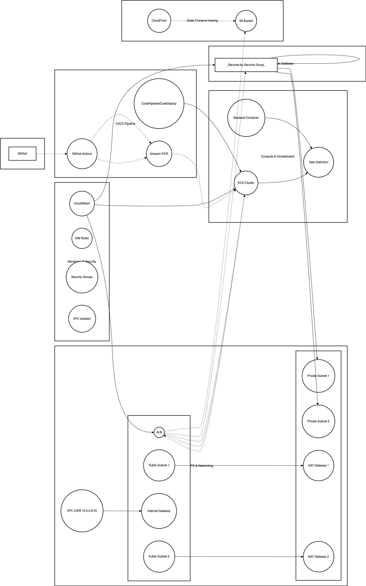

# DevHub Forum

**DevHub Forum** is a full-stack cloud application that showcases modern cloud engineering. It demonstrates containerization, IaC, CI/CD, and production-grade architecture on AWS—while also shipping a *live* demo on GitHub Pages that works without a server.

> **Live Demo:** https://andres-j-ramirez.github.io/devhub-forum/#/login  
> **Demo user:** `test@example.com` · **Password:** `devhub`

---

## Table of Contents
1. [Overview](#overview)
2. [Architecture](#architecture)
3. [Live Demo on GitHub Pages](#live-demo-on-github-pages)
4. [Local Development](#local-development)
5. [Production on AWS](#production-on-aws)
6. [Security & Monitoring](#security--monitoring)
7. [CI/CD (GitHub Actions)](#cicd-github-actions)
8. [Environment Variables](#environment-variables)
9. [Troubleshooting](#troubleshooting)
10. [Future Improvements](#future-improvements)
11. [License](#license)

---

## Overview

- **Frontend:** Vue.js + Tailwind CSS  
- **Backend:** Node.js/Express (auth, posts, comments)  
- **Database:** PostgreSQL (AWS RDS)  
- **Containers:** Docker on **ECS Fargate** behind an **ALB**  
- **IaC:** Terraform (VPC, subnets, ECS, RDS, ALB, CloudWatch, IAM)  
- **CI/CD:** GitHub Actions (Pages for frontend demo, ECS deploy for backend)  
- **Security & Observability:** IAM least privilege, KMS encryption, VPC isolation, CloudWatch dashboards/alarms

Users can register, log in, create posts and comments. This repository contains **both** application code and infrastructure.

---

## Architecture



*VPC with public subnets (ALB) and private subnets (ECS, RDS); ECR for images; CloudWatch for metrics; GitHub Actions for CI/CD.*

---

## Live Demo on GitHub Pages

The demo is **fully interactive** and safe to run without a backend:

- The router uses **`createWebHashHistory()`** so refreshes don’t 404 on Pages.
- An **Axios interceptor** detects `*.github.io` and returns **mocked** responses for:
  - `POST /api/auth/login` → returns `{ token: 'demo' }` when using the demo creds
  - `GET /api/posts` → returns a curated list of posts
- Off Pages (local dev or AWS), Axios uses your **real API base URL**.

This lets recruiters experience the app immediately, while the real stack remains production-ready.

---

## Local Development

**Requirements:** Node 18+, Docker (optional for DB)

### 1) Backend
```bash
cd backend
npm install
# .env described below
npm start   # starts on http://localhost:5001
# Health check: GET /health
